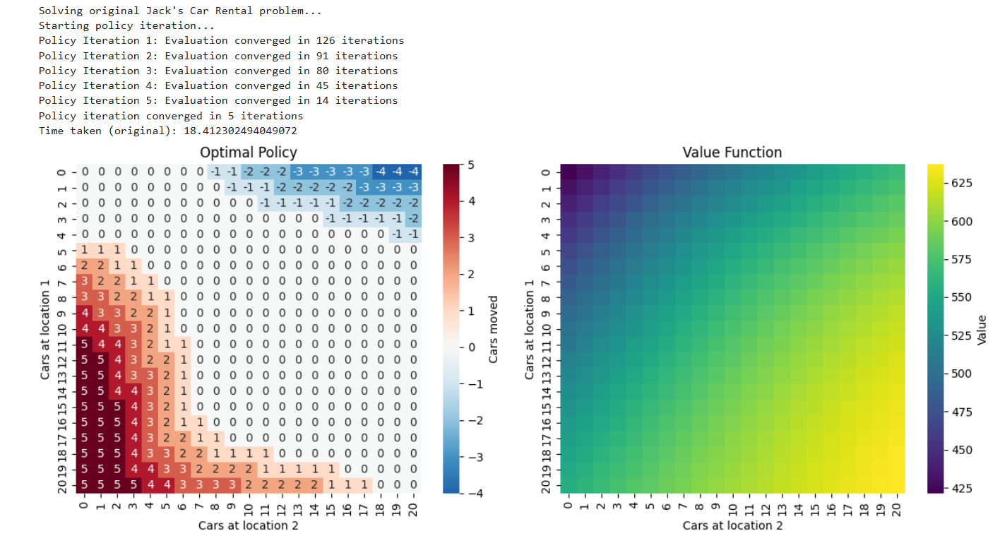
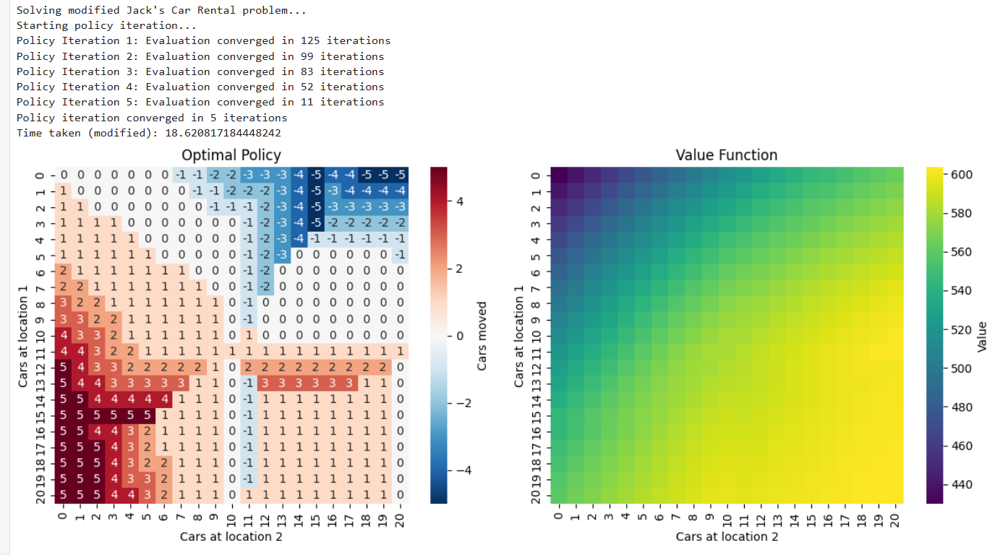

# Jack's Car Rental - Policy Iteration

This project implements the **Jack's Car Rental problem** from *Reinforcement Learning: An Introduction* (Sutton & Barto). It uses **policy iteration** to solve the problem, both in the **original** and **modified** versions. The solution is optimized with **Numba JIT compilation** and visualized using heatmaps.

---

## 🚀 Features
- Implementation of **policy evaluation** and **policy improvement**.
- Support for both:
  - Original Jack's Car Rental problem.
  - Modified version (with free shuttle service and parking costs).
- Optimized with **Numba** for faster computation.
- Visualizations:
  - Heatmap of the optimal policy.
  - Heatmap of the value function.

---

## ⚙️ Installation

1. Clone this repository:
   ```bash
   git clone https://github.com/<your-username>/<your-repo>.git
   cd <your-repo>


## 📊 Usage Example Output
Optimal Policy
Value Function

After running the program, the following visualizations are generated:

### 🔹 Optimal Policy and Value function Heatmap


### 🔹 Modified Heatmap

